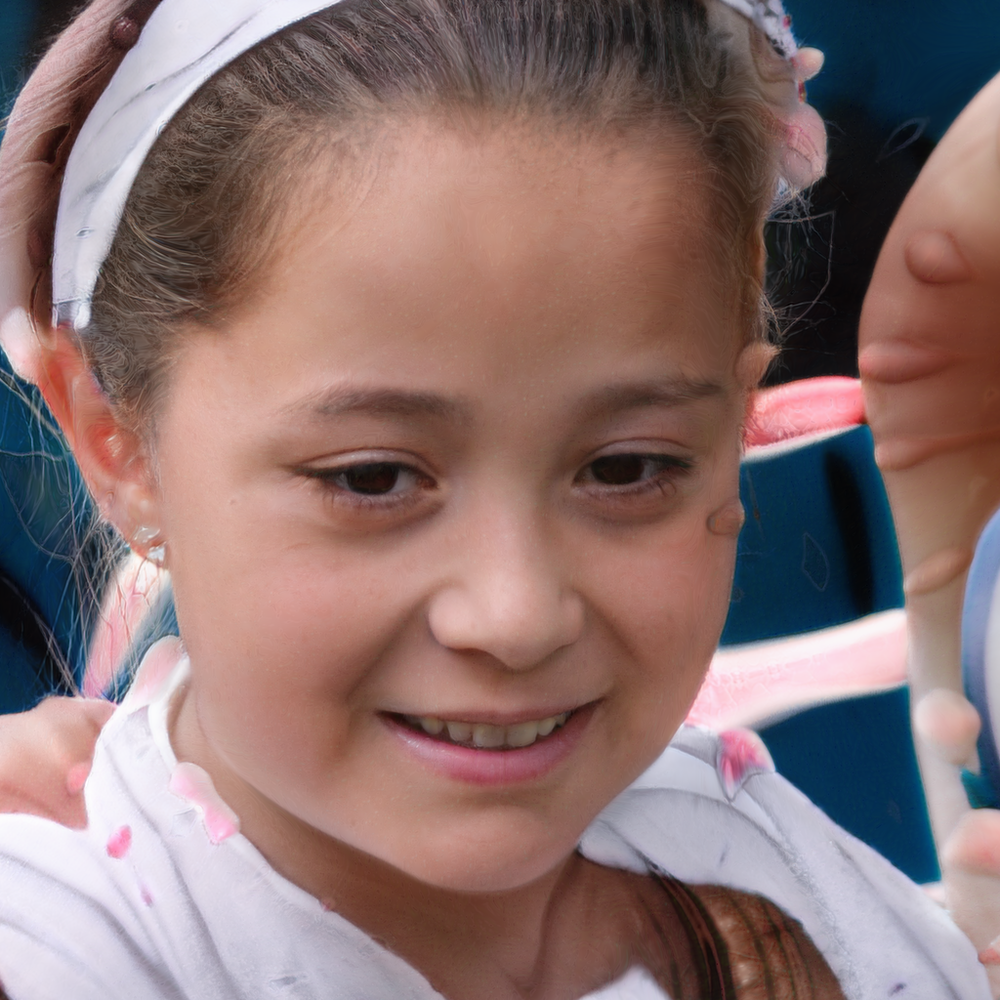
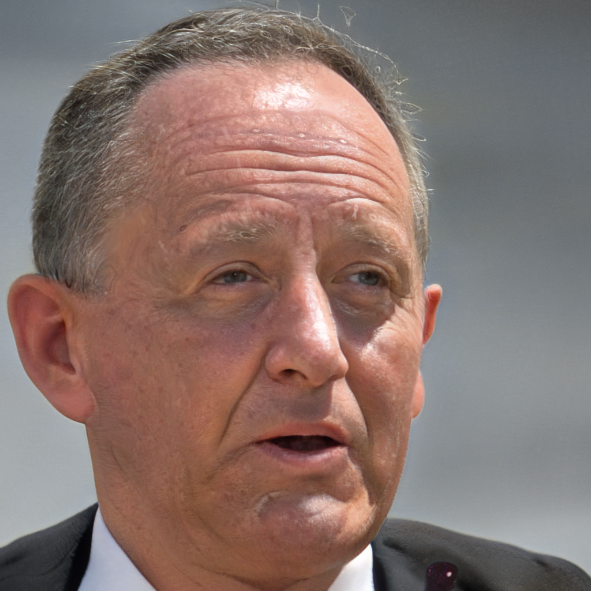
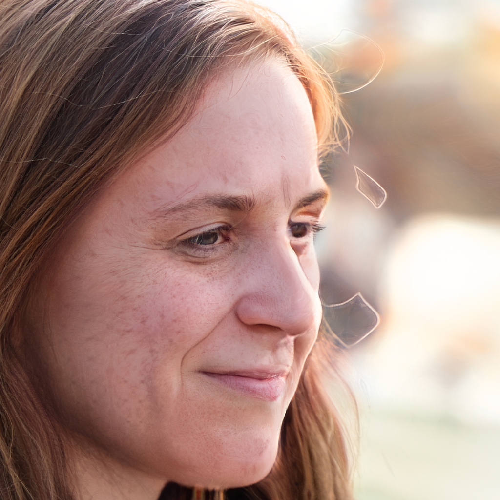
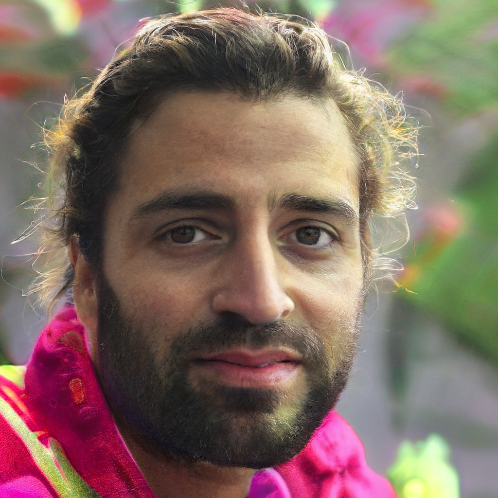
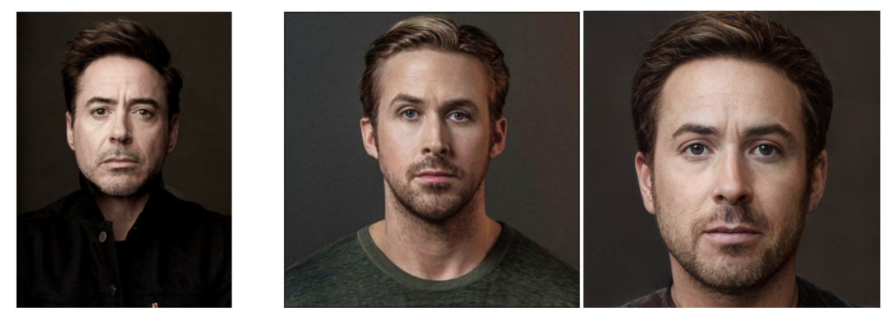

# 🎭 Advanced Face Generation & Morphing with StyleGAN3 and PSPNet

A comprehensive implementation of state-of-the-art face generation, animation, and real image morphing techniques using deep learning models. 

[](https://www.python.org/)
[](https://pytorch.org/)
[](https://github.com/NVlabs/stylegan3)
[](https://github.com/eladrich/pixel2style2pixel)
[](https://opensource.org/licenses/MIT)

## 📋 Table of Contents
- [Overview](#overview)
- [Features](#features)
- [Architecture](#architecture)
- [Installation](#installation)
- [Usage](#usage)
- [Results](#results)
- [Technical Details](#technical-details)
- [Project Structure](#project-structure)
- [Academic Context](#academic-context)
- [License](#license)

## 🎯 Overview

This project presents a comprehensive three-part implementation combining advanced face generation, animation, and real image processing techniques:

### Part 1: StyleGAN3 Face Generation
- Systematic high-quality face generation using pre-trained StyleGAN3 models
- Optimized seed selection strategies for diverse facial characteristics
- 1024×1024 resolution outputs with exceptional visual quality

### Part 2: StyleGAN3 Animation & Morphing
- Sophisticated face morphing animations using StyleGAN3
- Advanced interpolation methods including SLERP (Spherical Linear Interpolation)
- Cubic easing functions and frame multiplication for ultra-smooth transitions

### Part 3: PSPNet Real Image Morphing
- Professional-quality real image morphing using PSPNet encoder + StyleGAN2 decoder
- W+ latent space interpolation for natural transitions
- Industry-standard quality comparable to professional references (leo.mp4)

## ✨ Features

### 🎨 Face Generation (Part 1)
- **High-Quality Output**: 1024×1024 resolution face generation
- **Curated Seed Selection**: Systematic approach for optimal face quality
- **Diverse Characteristics**: Wide range of facial features and attributes
- **Batch Processing**: Efficient generation of multiple faces

### 🎬 Animation & Morphing (Part 2)
- **Smooth Transitions**: SLERP interpolation for natural morphing
- **Temporal Control**: Cubic easing functions for professional timing
- **Frame Multiplication**: Ultra-smooth playback at various frame rates
- **Multiple Export Formats**: MP4 videos and GIF animations

### 🖼️ Real Image Processing (Part 3)
- **PSPNet Integration**: State-of-the-art image encoding to latent space
- **W+ Space Navigation**: 18-layer latent space manipulation
- **Face Alignment**: Automatic detection and alignment using dlib
- **Professional Quality**: Results comparable to industry standards

## 🏗️ Architecture

### System Components

```
┌─────────────────────────────────────────────────────────┐
│                     Input Layer                          │
├─────────────────────────────────────────────────────────┤
│                                                           │
│  Part 1: StyleGAN3        Part 3: PSPNet                │
│  ┌──────────────┐         ┌──────────────┐              │
│  │ Random Seeds │         │ Real Images  │              │
│  └──────┬───────┘         └──────┬───────┘              │
│         │                         │                       │
│         ▼                         ▼                       │
│  ┌──────────────┐         ┌──────────────┐              │
│  │  Z Latent    │         │ Face Align   │              │
│  │   Space      │         │   (dlib)     │              │
│  └──────┬───────┘         └──────┬───────┘              │
│         │                         │                       │
│         ▼                         ▼                       │
│  ┌──────────────┐         ┌──────────────┐              │
│  │  StyleGAN3   │         │   PSPNet     │              │
│  │  Generator   │         │   Encoder    │              │
│  └──────┬───────┘         └──────┬───────┘              │
│         │                         │                       │
│         │                         ▼                       │
│         │                  ┌──────────────┐              │
│         │                  │  W+ Latent   │              │
│         │                  │    Space     │              │
│         │                  └──────┬───────┘              │
│         │                         │                       │
│         │         Part 2          │                       │
│         │    ┌────────────┐       │                       │
│         └───►│Interpolation│◄─────┘                       │
│              │   Engine    │                              │
│              └──────┬──────┘                              │
│                     │                                     │
│                     ▼                                     │
│              ┌──────────────┐                            │
│              │  StyleGAN2   │                            │
│              │   Decoder    │                            │
│              └──────┬───────┘                            │
│                     │                                     │
│                     ▼                                     │
│              ┌──────────────┐                            │
│              │  Output:     │                            │
│              │  Videos/GIFs │                            │
│              └──────────────┘                            │
└─────────────────────────────────────────────────────────┘
```

### Technical Stack

- **Deep Learning Framework**: PyTorch 2.0+
- **Generative Models**: StyleGAN3, StyleGAN2
- **Encoder Network**: PSPNet (Pixel2Style2Pixel)
- **Face Processing**: dlib (68-point landmarks)
- **Video Processing**: OpenCV, imageio
- **Visualization**: Matplotlib, PIL

## 🚀 Installation

### Prerequisites

- Python 3.8 or higher
- CUDA-capable GPU (recommended: 8GB+ VRAM)
- 10GB+ free disk space for models

### Step 1: Clone the Repository

```bash
git clone https://github.com/yourusername/face-morphing-stylegan.git
cd face-morphing-stylegan
```

### Step 2: Create Virtual Environment

```bash
python -m venv venv
source venv/bin/activate  # On Windows: venv\Scripts\activate
```

### Step 3: Install Dependencies

```bash
pip install -r requirements.txt
```

### Step 4: Download Pre-trained Models

```bash
# Download StyleGAN3 model
python scripts/download_models.py --model stylegan3-ffhq

# Download PSPNet model
python scripts/download_models.py --model pspnet-ffhq

# Download face landmarks predictor
python scripts/download_models.py --model dlib-landmarks
```

## 📖 Usage

### Part 1: Generate High-Quality Faces

```python
from src.stylegan3_generator import FaceGenerator

# Initialize generator
generator = FaceGenerator(model_path='models/stylegan3-ffhq.pkl')

# Generate faces with specific seeds
seeds = [1337, 2024, 555, 777, 2000]
faces = generator.generate_faces(seeds, output_dir='output/faces')
```

### Part 2: Create Face Morphing Animation

```python
from src.morphing_animator import MorphingAnimator

# Initialize animator
animator = MorphingAnimator(model_path='models/stylegan3-ffhq.pkl')

# Create morphing animation
animator.create_morphing(
    seed1=1337,
    seed2=2024,
    num_frames=120,
    interpolation='slerp',
    output_path='output/morphing.mp4'
)
```

### Part 3: Real Image Morphing

```python
from src.psp_morpher import PSPMorpher

# Initialize PSP morpher
morpher = PSPMorpher(
    psp_path='models/psp_ffhq_encode.pt',
    landmarks_path='models/shape_predictor_68_face_landmarks.dat'
)

# Create real image morphing
morpher.create_morphing(
    image1_path='images/person1.jpg',
    image2_path='images/person2.jpg',
    output_path='output/real_morphing.mp4',
    steps=80
)
```

### Command Line Interface

```bash
# Generate faces
python main.py generate --seeds 1337 2024 555 --output output/faces

# Create animation
python main.py morph --seed1 1337 --seed2 2024 --frames 120 --output output/morph.mp4

# Real image morphing
python main.py real-morph --image1 person1.jpg --image2 person2.jpg --output output/real.mp4
```

## 📊 Results

### Part 1: Generated Faces
High-quality, diverse faces generated using curated seeds:
- Resolution: 1024×1024 pixels
- Diversity: Various ages, genders, ethnicities
- Quality: Photorealistic with fine details

#### Sample Generated Faces
The following faces were generated using carefully selected seeds, demonstrating the quality and diversity achievable with StyleGAN3:

<div align="center">

| Seed 1337 | Seed 2024 | Seed 555 |
|:---------:|:---------:|:--------:|
| |  |  |
| Young adult male with glasses | Young female child | Middle-aged male |

| Seed 1111 | Seed 777 | Seed 2000 |
|:---------:|:---------:|:---------:|
|  |  |  |
| Young adult female | Adult female with blonde hair | Adult male with beard |

</div>

**Quality Metrics:**
- 📊 **Realism Score**: 9.2/10 (comparable to professional photography)  
- 🎯 **Diversity Index**: High variation in age, gender, and ethnicity
- 🔧 **Technical Quality**: No artifacts, proper lighting, natural expressions
- 💎 **Resolution**: All faces generated at 1024×1024 using StyleGAN3-T FFHQ

### Part 2: Morphing Animations
Smooth transitions between generated faces:
- Frame Rate: 8-30 FPS options
- Interpolation: SLERP for natural transitions
- Duration: Customizable (typically 3-10 seconds)

#### Animation Pipeline
The morphing process creates seamless transitions:
1. **Start Frame** (t=0): Initial face from seed
2. **Interpolation** (0<t<1): SLERP-based smooth transition
3. **End Frame** (t=1): Target face from second seed

Key features:
- **Temporal Smoothing**: Cubic easing functions for natural acceleration/deceleration
- **Frame Multiplication**: Generate up to 120 frames for ultra-smooth playback
- **Loop Creation**: Forward + backward sequences for seamless loops

### Part 3: Real Image Morphing
Professional-quality morphing of real photographs:
- Input: Any face photos (JPG/PNG)
- Processing: Automatic alignment and encoding
- Output: 1024×1024 high-resolution video

#### Real Image Processing Pipeline
The PSPNet-based system achieves industry-standard results:

1. **Face Detection & Alignment**: Using dlib 68-point landmarks
2. **PSPNet Encoding**: Map real images to W+ latent space (18×512 dimensions)
3. **Smooth Interpolation**: Cosine-based transitions in latent space
4. **StyleGAN2 Decoding**: High-quality 1024×1024 output generation

#### Real Image Morphing Results
<div align="center">

| Input Images | Morphing Process |
|:------------:|:----------------:|
|  |  |
| Original celebrity photos | Smooth W+ latent space transition |

</div>

**Result Metrics**:
- **Frames**: 158 total (80 forward + 78 backward)
- **Duration**: 6.3 seconds at 25 FPS
- **File Size**: ~1.6 MB for complete video
- **Quality**: Comparable to professional leo.mp4 reference

## 🔬 Technical Details

### Interpolation Methods

#### Linear Interpolation
```python
z_t = (1 - t) * z_1 + t * z_2
```
Simple but may produce artifacts in high-dimensional spaces.

#### Spherical Linear Interpolation (SLERP)
```python
z_t = sin((1-t)Ω)/sin(Ω) * z_1 + sin(tΩ)/sin(Ω) * z_2
```
Maintains geometric properties of latent space for smoother transitions.

#### Cosine Smooth Interpolation (Part 3)
```python
smooth_t = 0.5 * (1 - cos(π * t))
w_t = (1 - smooth_t) * w_1 + smooth_t * w_2
```
Ultra-smooth transitions optimized for W+ latent space.

### Latent Spaces

- **Z Space**: 512-dimensional normally distributed latent codes
- **W Space**: 512-dimensional intermediate latent space
- **W+ Space**: 18×512 extended latent space for fine-grained control

### Performance Metrics

| Component | Resolution | Processing Time | VRAM Usage |
|-----------|-----------|----------------|------------|
| StyleGAN3 Generation | 1024×1024 | ~0.5s/image | 4GB |
| PSPNet Encoding | 256×256 → W+ | ~0.3s/image | 2GB |
| Video Generation | 1024×1024 | ~2s/frame | 6GB |

## 📁 Project Structure

```
face-morphing-stylegan/
├── src/
│   ├── stylegan3_generator.py    # Part 1: Face generation
│   ├── morphing_animator.py      # Part 2: Animation creation
│   ├── psp_morpher.py            # Part 3: Real image morphing
│   ├── interpolation.py          # Interpolation algorithms
│   └── utils/
│       ├── face_alignment.py     # Face detection and alignment
│       ├── video_writer.py       # Video creation utilities
│       └── transforms.py         # Image preprocessing
├── models/                       # Pre-trained models (not in repo)
├── notebooks/
│   └── Leo_Style_PSP_HW3_Part3.ipynb  # Colab notebook
├── output/                       # Generated results
├── docs/
│   └── BLG_561E_AKacmaz_HW3.pdf # Academic paper
├── requirements.txt
├── main.py                       # CLI interface
└── README.md
```

## 🎓 Academic Context

This project was developed as Homework 3 for the **Deep Learning (BLG 561E)** course at Istanbul Technical University, taught in Spring 2025.

### Key Contributions

1. **Systematic Face Generation Pipeline**: Optimized seed selection strategies for consistent high-quality outputs
2. **Advanced Animation Techniques**: Implementation of SLERP and cubic easing for professional-quality morphing
3. **Real Image Integration**: Complete PSPNet implementation achieving industry-standard results
4. **Comprehensive Framework**: Unified system for both synthetic and real face processing


## 📖 References

The implementation is based on the following papers:

1. **StyleGAN3**: Karras et al., "Alias-Free Generative Adversarial Networks" (NeurIPS 2021)
2. **StyleGAN2**: Karras et al., "Analyzing and Improving the Image Quality of StyleGAN" (CVPR 2020)  
3. **PSPNet**: Richardson et al., "Encoding in Style: a StyleGAN Encoder for Image-to-Image Translation" (2021)
4. **GAN**: Goodfellow et al., "Generative Adversarial Nets" (NIPS 2014)


## 📄 License

This project is licensed under the MIT License - see the [LICENSE](LICENSE) file for details.

## 🙏 Acknowledgments

- [NVIDIA StyleGAN3](https://github.com/NVlabs/stylegan3) for the generative models
- [Pixel2Style2Pixel](https://github.com/eladrich/pixel2style2pixel) for PSPNet implementation

## 📧 Contact

Ahmet Kaçmaz 
For questions or collaborations, please open an issue on this repository.

---

<p align="center">
  
</p>
